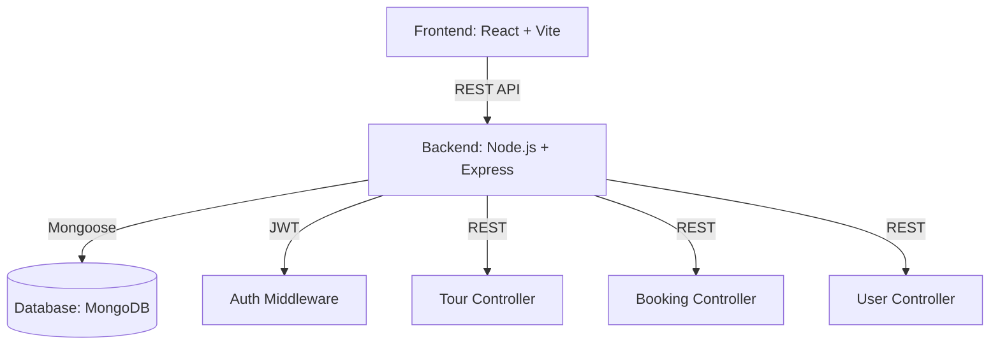

# Tours Management System - Project Documentation

## 1. Introduction
The Tours Management System is a comprehensive MERN (MongoDB, Express.js, React.js, Node.js) application designed for a travel agency to manage tour packages, guide assignments, and customer bookings. The system features a modern, responsive UI with role-based access control, ensuring a tailored experience for Travelers, Guides, and Administrators.

## 2. Objectives
- Provide a secure and user-friendly platform for booking tours.
- Implement a robust backend with MVC architecture.
- Enable role-based dashboards for different user types.
- Ensure data integrity and secure authentication.
- Deliver a premium UI/UX with smooth animations.

## 3. Architecture Diagram

## 4. Database Schema
### User Model
- `name`: String
- `email`: String (Unique)
- `role`: Enum ('user', 'guide', 'lead-guide', 'admin')
- `password`: String (Hashed)
- `photo`: String
- `assignedTours`: Array of Tour IDs

### Tour Model
- `title`: String
- `slug`: String
- `duration`: Number
- `maxGroupSize`: Number
- `price`: Number
- `location`: String
- `guidesAssigned`: Array of User IDs (Guides)
- `availableSeats`: Number

### Booking Model
- `tour`: Reference to Tour
- `user`: Reference to User
- `price`: Number
- `bookingDate`: Date
- `status`: Enum ('pending', 'confirmed', 'cancelled')

## 5. API Documentation
### Auth
- `POST /api/v1/auth/register`: Create new account
- `POST /api/v1/auth/login`: Authenticate and receive JWT

### Tours
- `GET /api/v1/tours`: List all tours (supports filter/sort)
- `POST /api/v1/tours`: Create a tour (Admin/Lead-Guide only)
- `GET /api/v1/tours/:id`: Get detailed tour info

### Bookings
- `POST /api/v1/bookings`: Book a tour
- `GET /api/v1/bookings/my-bookings`: List user's bookings

## 6. Authentication Flow
1. User submits credentials.
2. Backend validates using `bcrypt`.
3. JWT is generated and sent back to the client.
4. Client stores JWT in `localStorage`.
5. Subsequent requests include JWT in `Authorization` header.
6. `protectRoute` middleware validates token and role.

## 7. Frontend Design
- **TailwindCSS**: Used for utility-first styling.
- **Framer Motion**: Implements smooth transitions and interactive hover effects.
- **Lucide React**: Provides a modern, consistent icon set.
- **Glassmorphism**: Applied to navbars and cards for a premium feel.

## 8. Screen Descriptions
- **Landing Page**: Showcases featured tours and platform stats.
- **Tours Listing**: Searchable and filterable grid of available trips.
- **Tour Details**: Deep dive into tour itinerary, guides, and booking portal.
- **Dashboards**:
  - **Admin**: System-wide analytics and management.
  - **Guide**: Personal schedule and participant management.
  - **User**: Booking history and profile settings.
- **Manage Tours**: Full CRUD interface for staff.

## 9. Conclusion
This project demonstrates a production-level integration of the MERN stack. It fulfills all requirements for a Final Year Project by implementing complex logic like role-based authorization, nested database relations, and a professional-grade frontend architecture.

## 10. Future Improvements
- Integrate a real payment gateway (Stripe).
- Add real-time chat between guides and travelers.
- Implement a review and rating system on the frontend.
- Add multi-language support.
